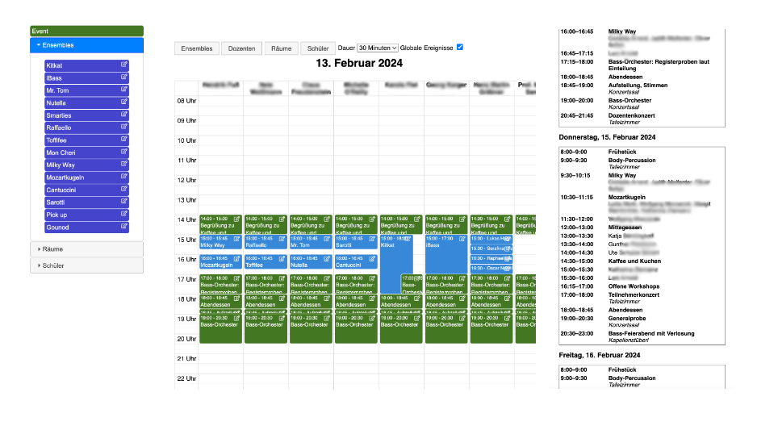
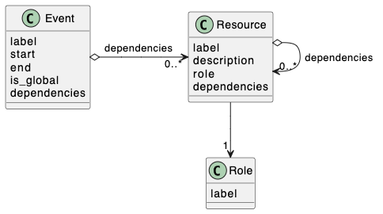

# MasterClass #

Eine Stundenplan-Software für Workshops auf Basis von Django.

## Aufgabenstellung ##
MasterClass wurde für das Bavarian Bass Camp entwickelt. Die zentralen Funktionen sind:

- Vermeidung von Terminkonflikten, z.B. zwei Teilnehmer sind zeitgleich bei verschiedenen Dozenten eingeteilt
- Erstellen von individuellen Stundenplänen für jeden Teilnehmer

Dazu gibt es zwei zentrale Ansichten: 

- In der Kalenderansicht planen die Workshopleiter die einzelnen Unterrichtseinheiten, sowie den gemeinsamen Rahmen.
- In der Stundenplanansicht gibt die Software einen Stundenplan für einen Schüler (Dozenten, Raum etc.) aus.

## Überblick über das Datenmodell (technische Beschreibung) ##

Das zugrundeliegende Datenmodell ist einfach, eröffnet aber viele Möglichkeiten.

In Stichpunkten:

- Eine *Resource* darf nicht zur gleichen Zeit mehrfach eingesetzt werden.
- Eine *Resource* hat eine bestimmte Rolle (*Role*), die definiert, ob es sich dabei um einen Schüler, einen Dozenten, einen Raum o.ä. handelt
- Eine *Resource* kann von anderen *Resources* abhängig sein (Attribut *dependencies*).
- *Events* definieren Termine, zu denen ein oder mehrere *Resources* (definiert durch Attribut *dependencies*) eingesetzt werden.

## Status des Projekts ##
Das Projekt ist noch nicht in einem Zustand, in dem es für die Allgemeinheit nutzbar ist. Die Nutzung setzt derzeit Erfahrung in der Software-Entwicklung mit Python voraus.

Ich arbeite ehrenamtlich an dem Projekt und bin bestrebt, es der Allgemeinheit zugänglich zu machen. Versprechungen kann ich leider keine geben.
